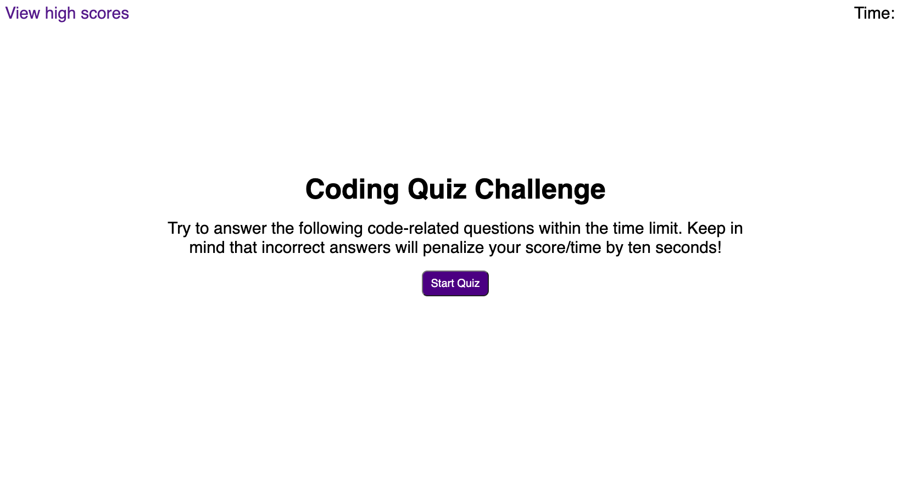
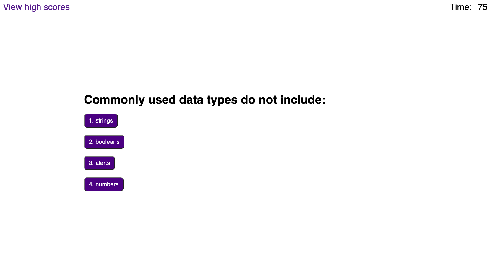
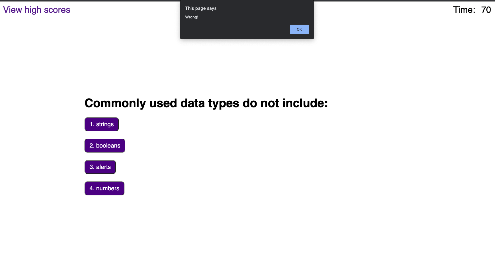
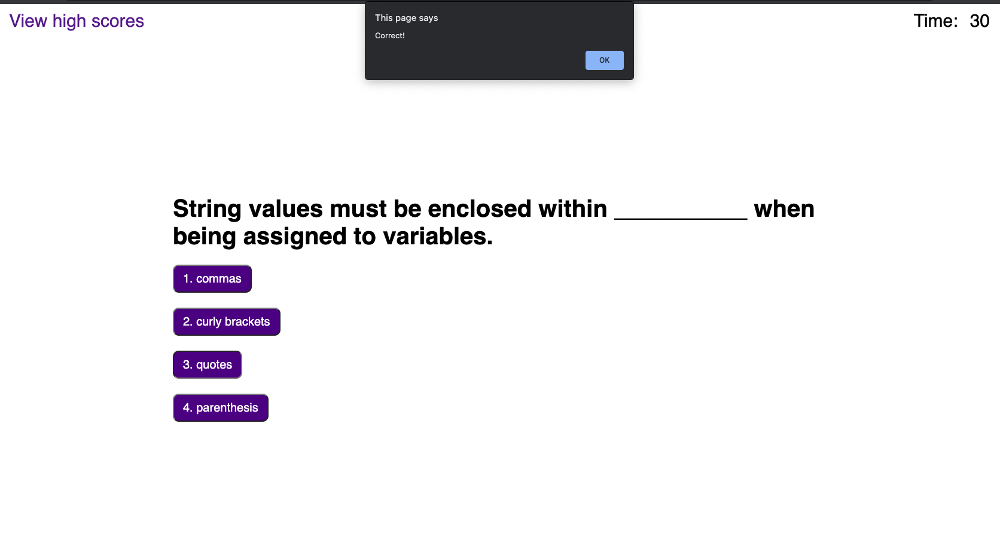
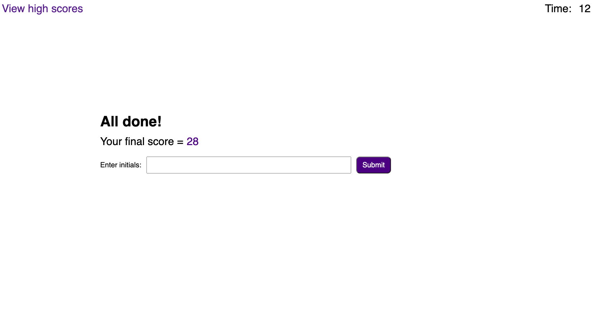
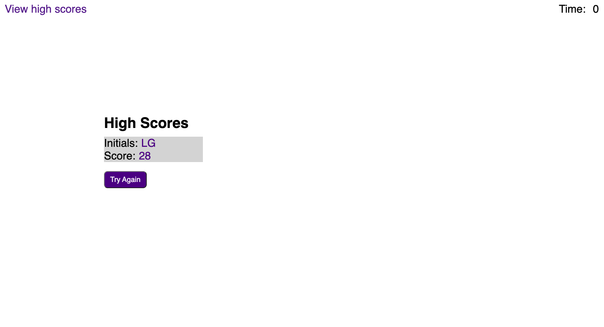

# CODE QUIZ
=========================================================================

## TABLE OF CONTENTS
--------------------

* Introduction
* User Instructions
* Technologies used
* Updates
* Maintainers

## INTRODUCTION
---------------

Code Quiz is a very self-explanatory quiz about coding. There are basic questions with high score and timer features, and an ability to add initials at the end. 

## USER INSTRUCTIONS
--------------------

1. Click "Start Quiz" button
2. Answer quiz questions by clicking answer buttons.
3. Clear "Correct!" and "Wrong!" alerts by clicking the "OK" button.
4. Game ends after questions are answered or time runs out.
5. User is presented with a final score and asked to enter initials. User should enter initials and click "Submit" button.
6. User is presented with high scores.
7. User can click "Try Again" to play another round.

**View the application, here:** [Password Generator](https://grohtech.github.io/Password-Generator/ "Password Generator")

**View website screenshots, here:**  

 
 
 
 
 

## TECHNOLOGIES USED
--------------------

* HTML
* CSS
* JavaScript

## UPDATES
----------

* **09.20.21 - Release Date**
    * Organized file structure
    * Set up quiz using HTML
    * Styled quiz using CSS
    * Created variables & functions
    * Added timer 
    * Added JS comments
    * Accessed DOM elements using JS

## MAINTAINERS
--------------

**Current maintainers**
1. Lauren Groh - [GitHub](https://github.com/GrohTech "GitHub Profile")